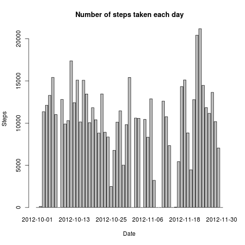
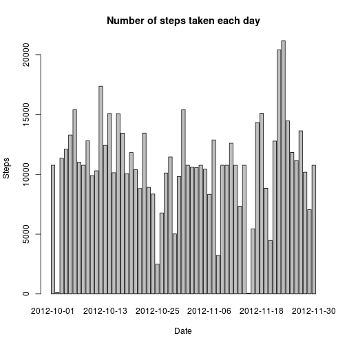

# Reproducible Research: Peer Assessment 1


## Prerequisites
We need to set up locale to make further work with dates consistent.
Also we need `data.table` library for convenient subsetting and expressions.

```r
Sys.setlocale("LC_TIME", "en_US")
```

```
## [1] "en_US"
```

```r
library(data.table)
```


## Loading and preprocessing the data
We need to unzip and read the data.

```r
unzip("activity.zip")
activity <- data.table(read.csv("activity.csv"))
```


## What is mean total number of steps taken per day?

```r
setkey(activity, date)
stepsPerDay <- activity[, sum(steps, na.rm=TRUE), date]
setnames(stepsPerDay, "V1", "steps")

with(stepsPerDay,
     barplot(steps, main="Number of steps taken each day", xlab="Date", ylab="Steps", names.arg=date)
)
```

 

_Please note we have removed missing values from computations using **na.rm=TRUE** option. As a result there are some zeros in the resulting data._

*Mean* and *median* total number of steps per day:

```r
meanmed <- stepsPerDay[, list(mean=mean(steps), median=median(steps))]
meanmed
```

```
##       mean median
## 1: 9354.23  10395
```

## What is the average daily activity pattern?

```r
setkey(activity, interval)
stepsPerInt <- activity[, mean(steps, na.rm=TRUE), interval]
setnames(stepsPerInt, "V1", "meanSteps")

stepsPerInt[,
     plot(x=interval, y=meanSteps, type="l", main="Number of steps taken per interval, averaged across all days")
]
```

 

```
## NULL
```

__Which 5-minute interval, on average across all the days in the dataset, contains the maximum number of steps?__

```r
with(stepsPerInt,
	interval[ which.max(meanSteps)]
)
```

```
## [1] 835
```

## Imputing missing values
Total number of missing values in the dataset:

```r
activity[, sum(is.na(steps))]
```

```
## [1] 2304
```
We fill NA's with mean for that 5-minute interval (across all the days):

```r
activity_f <- merge(activity, stepsPerInt, by="interval")
isna <- activity_f[, is.na(steps)]
activity_f$steps[isna] <- activity_f$meanSteps[isna]
activity_f$meanSteps <- NULL ## drop this column
```
__What is mean total number of steps taken per day for the corrected dataset?__

```r
setkey(activity_f, date)
stepsPerDay_f <- activity_f[, sum(steps), date]
setnames(stepsPerDay_f, "V1", "steps")

with(stepsPerDay_f,
     barplot(steps, main="Number of steps taken each day", xlab="Date", ylab="Steps", names.arg=date)
)
```

 

*Mean* and *median* total number of steps per day for the corrected dataset:

```r
meanmed_f <- stepsPerDay_f[, list(mean=mean(steps), median=median(steps))]
meanmed_f
```

```
##        mean   median
## 1: 10766.19 10766.19
```
Correction slightly changed *mean* and *median*. In absolute value the change is:

```r
meanmed_f - meanmed
```

```
##        mean   median
## 1: 1411.959 371.1887
```
or per cent:

```r
100 * (meanmed_f - meanmed) / meanmed_f
```

```
##        mean   median
## 1: 13.11475 3.447726
```


## Are there differences in activity patterns between weekdays and weekends?
We added new factor variable indicating part of the week (i.e. weekend or weekday):

```r
activity_f$weekdayType <- factor(weekdays(as.Date(activity_f$date)) %in% c("Saturday", "Sunday"),
                                 levels = c("FALSE", "TRUE"),
								 labels = c("weekday", "weekend"))
```

A time series plot of the 5-minute interval (x-axis) and the average number of steps taken,
averaged across all weekday days or weekend days (y-axis):

```r
setkey(activity_f, interval)
stepsPerInt_f <- activity_f[, mean(steps), by=c("interval", "weekdayType") ]
setnames(stepsPerInt_f, "V1", "meanSteps")

par(mfrow=c(2,1))
stepsPerInt_f[,
	plot(x=interval, y=meanSteps, type="l", main=paste("Averaged across all",weekdayType,"days")),
	by=weekdayType
]
```

 

```
## Empty data.table (0 rows) of 1 col: weekdayType
```

There are some differences in activity patterns between weekdays and weekends.

